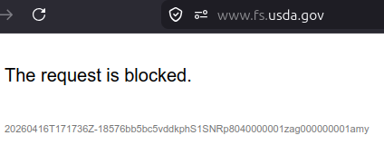

# What is happening with the US Forest Service FIDL website?

```{note}
See **Current status** at the end of this post.
```

```{note}
USDA is apparently blocking public access to **Forest Insect and Disease Leaflet (FIDL)** documents, including one on coconut rhinoceros beetle (CRB) prepared by University of Guam faculty and staff.  

Clicking on existing links to FIDLS currently returns blank pages with nothing more than "The request is blocked."

I am a little frustrated by this situation because I am trying to share the CRB FIDL with colleagues in Hawaii ([see this blog post](crb_refs.md)). I am also curious to find out what is happening. 
A quick Google search turned up no useful info. 
So I decided to give Gemini a shot. 
Here are the results. 

```

# My Gemini prompt

The United States Forest Service had a website where they published FIDLs, a series of documents about forest insects and diseases. Recently, links to FIDL documents have been blocked. What has happened?

# Gemini response

The disappearance of the **Forest Insect and Disease Leaflet (FIDL)** documents is part of a broader, ongoing restructuring of the U.S. Department of Agriculture (USDA) and the Forest Service (USFS) that began in early 2025.

If you are seeing "not authorized" or 404 error messages where those PDFs used to be, it is likely due to one of the following recent events:

## 1\. Removal of Content Related to Climate Change

In late January 2025, the USDA was directed to "archive or unpublish" web pages and resources that focused on or referenced the climate crisis. Because many modern FIDLs discuss how changing climate patterns affect pest outbreaks and forest health, large sections of the research and publication landing pages were taken offline for review.

## 2\. Agency Restructuring and Relocation

As of **March 31, 2026**, the Forest Service is undergoing a massive organizational shake-up. The agency’s headquarters is moving from Washington, D.C., to **Salt Lake City, Utah**, and its regional research stations are being consolidated into a single facility in **Fort Collins, Colorado**. This "operational service center" model has led to the shuttering of many regional servers and the migration of digital libraries, causing many legacy links to break.

## 3\. Website Migration to "OneUSDA"

The Forest Service has been migrating its digital assets to the **OneUSDA** intranet and a more centralized public-facing portal. During these transitions, "deep links" to specific PDF documents (like the FIDL series) are frequently broken or placed behind permissions walls while they are audited for accessibility compliance (Section 508) or updated scientific accuracy.

-----

## Where to Find FIDLs Now

While the main USFS landing pages may be unreliable during this transition, you can still access these documents through secondary federal repositories:

  * **GovInfo (GPO):** The Government Publishing Office maintains a permanent digital archive of federal publications. Searching for "Forest Insect and Disease Leaflet" on **[govinfo.gov](https://www.govinfo.gov)** is currently the most reliable way to find the PDFs.
  * **HathiTrust Digital Library:** They host a massive collection of digitized USFS publications, including the older "Forest Pest Leaflet" series.
  * **TreeSearch:** This is the Forest Service's internal research database. While some landing pages are down, the **[TreeSearch database](https://www.google.com/search?q=https://www.fs.usda.gov/treesearch/)** often still hosts the actual PDF files for individual leaflets.
  * **Regional Contacts:** If you need a specific leaflet for management purposes, the National FIDL Coordinator (Robbie Flowers) and regional forest health protection staff are still active and can often email copies directly.

The links are likely not "blocked" in a permanent legal sense, but rather "dark" due to a combination of administrative review and a massive physical and digital relocation of the agency's resources.

## Response from USDA FS on April 11, 2025

In response to emails I sent to USDA regarding my access to FIDLs being blocked, I received an email containing this information:

"Access outside of the U.S. is blocked due to a recurrent DDoS attack from a foreign country.
After reminding [...] that Guam is a U.S. Territory, they have removed the block and now all U.S. Territories have access."

## Current status as of April 17, 2025

The situation is worse than I originally thought. It looks like my access to the entire US Forest Service website is blocked when I try to access information from the Philippines.

Here is the response when I click on [https://www.fs.usda.gov](https://www.fs.usda.gov):



