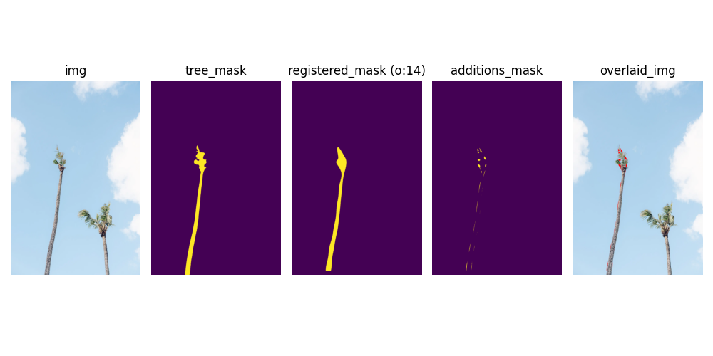
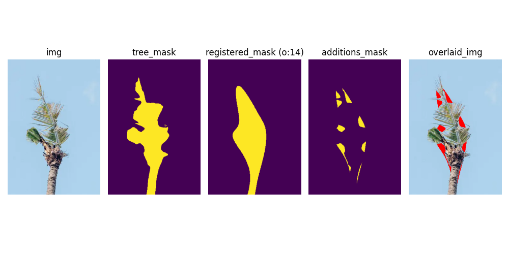

The purpose of this post is to share info on my attempts to improve detection of coconut rhinoceros beetle damage detection in roadside imagery.

My new workflow uses these steps:

1. **Input** is a collection of roadside images which may or may not have metadata (timestamp, GPS coordinates, etc) embedded (in EXIF). Data may come from a variety of sources including automated roadside surveys, individual images, or web images publicly available on the WWW (social platforms, iNatualist, etc.).
2. Coconut palms are detected in each image using the Segment Anything model (SAM3). This AI model requires no training and it does an excellent job of finding all coconut palms in an image, even dead ones ([related post](sam3.md)).
1. Each coconut palm detected in step 1. is examined for signs of CRB damage (v-shaped cuts etc.). I originally trained an AI model to do this step. But in this development cycle, I am using computer vision (CV) instead.
1. **Output** is saved in a database which can be used to generate interactive web maps and statistical reports to monitor changes in CRB damage over space and time. 


```{figure} https://github.com/aubreymoore/sam3-2026-01-31/blob/main/08hs-palms-03-zglw-superJumbo.webp?raw=true
:label: nytimes
A simple test image posted on the WWW by the New York Times.
```

```{figure} images/sam3-08hs-palms-03-zglw-superJumbo.jpg
:label: fig-sam-nytimes
SAM3 detection results from the simple image. This is the default annotated image returned by SAM3.
Numbers are confidence levels. SAM3 performed very well on this image, returning high confidence detections and precise segmentation even tough the two coconut palms were heavily damaged ([](#fig-sam-nytimes)).
```

```{figure}

```

```{figure}

```
