# Introduction

This page documents my evaluation of SAM3, the most recent Segment Anything Model, for automated detection of coconut palm trees.

Code associated with this page is available at https://github.com/aubreymoore/sam3-2026-01-31

We start by running SAM3 on two test images:

- The first image ([](#nytimes))  is simple. It is from a NewYork Times article posted on the internet and it contains two coconut palms heavily damaged by coconut rhinoceros beetle (CRB). 
- The second image ([](#efate)) is complex. It is from a recent roadside survey of CRB damage on Efate Island in Vanuatu and it contains many coconut palms with various levels of damage.

```{figure} https://github.com/aubreymoore/sam3-2026-01-31/blob/main/08hs-palms-03-zglw-superJumbo.webp?raw=true
:label: nytimes
A simple test image posted on the internet by the New York Times.
```

```{figure} https://github.com/aubreymoore/sam3-2026-01-31/blob/main/20251129_152106.jpg?raw=true
:label: efate
A complex test image from a roadside coconut rhinoceros damage survey conducted on Efate Island, Vanuatu.
```

## SAM3 detection results for a simple image

SAM3 performed very well on this image, returning high confidence detections and precise segmentation even tough the two coconut palms were heavily damaged ([](#fig-sam-nytimes)).

```{figure} images/sam3-08hs-palms-03-zglw-superJumbo.jpg
:label: fig-sam-nytimes
SAM3 detection results from the simple image. This is the default annotated image returned by SAM3.
Numbers are confidence levels.
```
## SAM3 detection results for a complex image

SAM3 detected 25 coconut palms in this complex image. 
The default annotation image returned by SAM3 is too cluttered to be of much use,so I wrote my own code to display each detection separately.
The resulting images are displayed descending order of confidence.

A first look at these detections indicates that SAM3 does a remarkable job at detecting coconut palms in a complex image. 
It even finds dead standing stems without fronds and small objects.

There are no obvious false positive detections. However, a few detections include two or more coconut palms. 
Many of the segmentation masks are incomplete because palms are occluded by foreground objects.

```{figure} images/sam3-20251129_152106.jpg
:label: fig-sam-efate

SAM3 detection results from the complex image. This is the default annotation returned by SAM3.
Numbers are confidence levels.
```
---
## Detected object 02 confidence: 0.842 object_index: 16

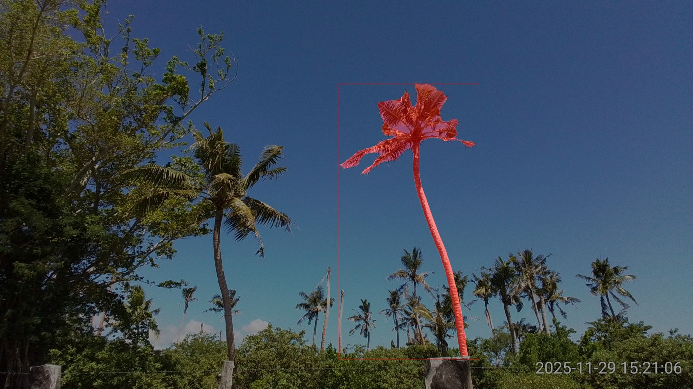

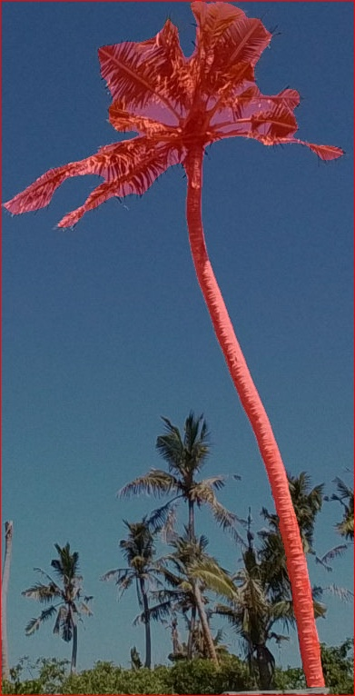

### Attributes

- [x] accept
- [] healthy
- [x] damaged
- [] vcuts
- [] dead
- [] crowd
- [] occluded
- [] other_problem
---
## Detected object 03 confidence: 0.771 object_index: 5

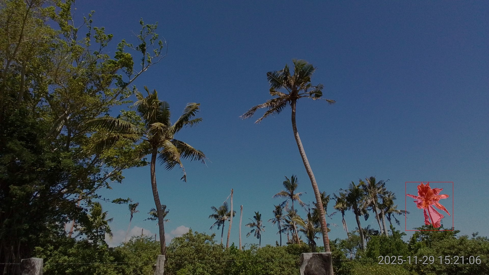

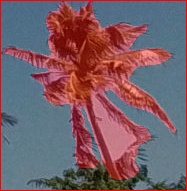

### Attributes

- [] accept
- [x] healthy
- [] damaged
- [] vcuts
- [] dead
- [x] crowd
- [] occluded
- [] other_problem


## Detected object 04 confidence: 0.764 object_index: 9

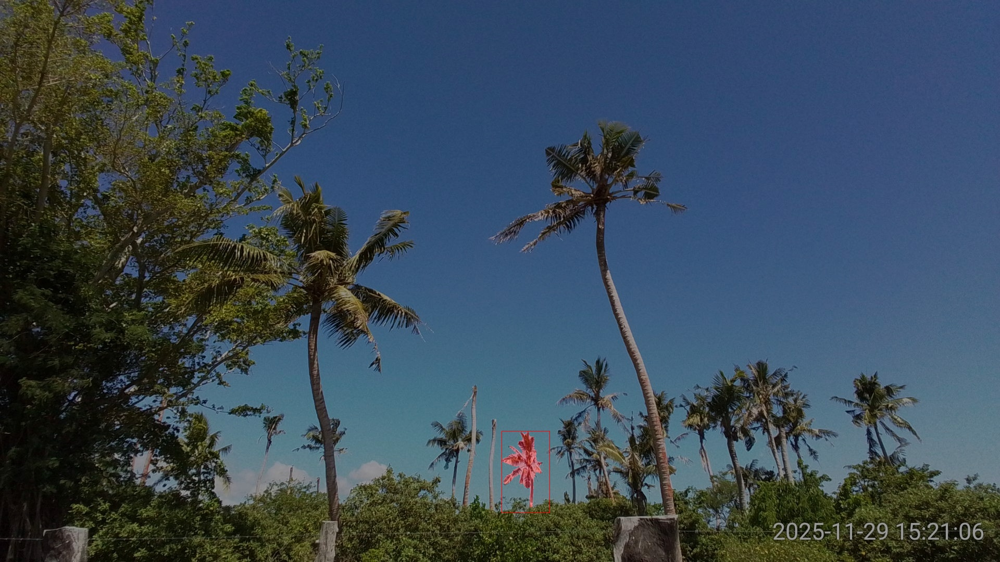

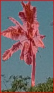

### Attributes

- [x] accept
- [] healthy
- [x] damaged
- [] vcuts
- [] dead
- [] crowd
- [] occluded
- [] other_problem
---

## Detected object 05 confidence: 0.743 object_index: 3

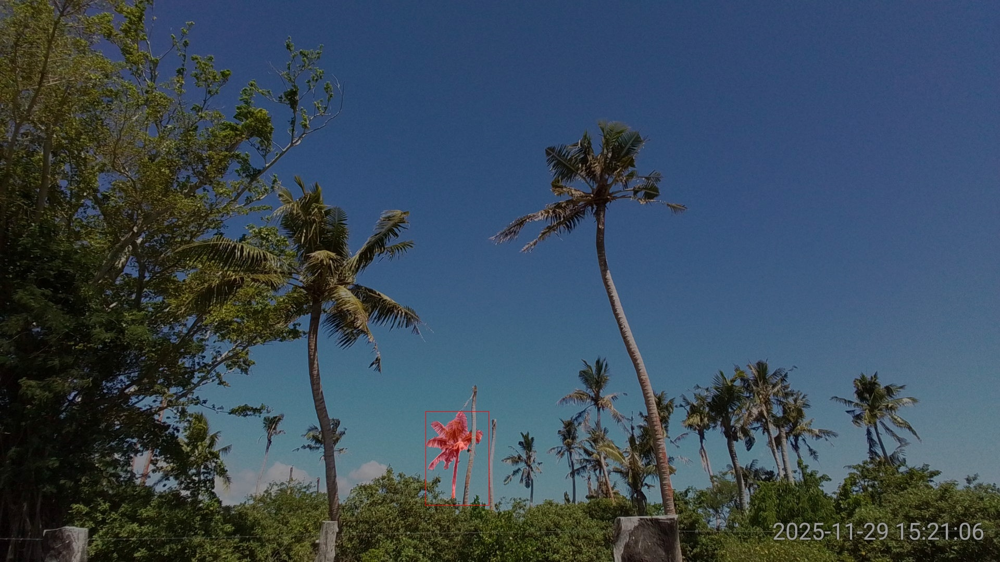

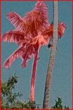

### Attributes

- [] accept
- [x] healthy
- [] damaged
- [] vcuts
- [] dead
- [] crowd
- [x] occluded
- [] other_problem
---
## Detected object 06 confidence: 0.730 object_index: 12

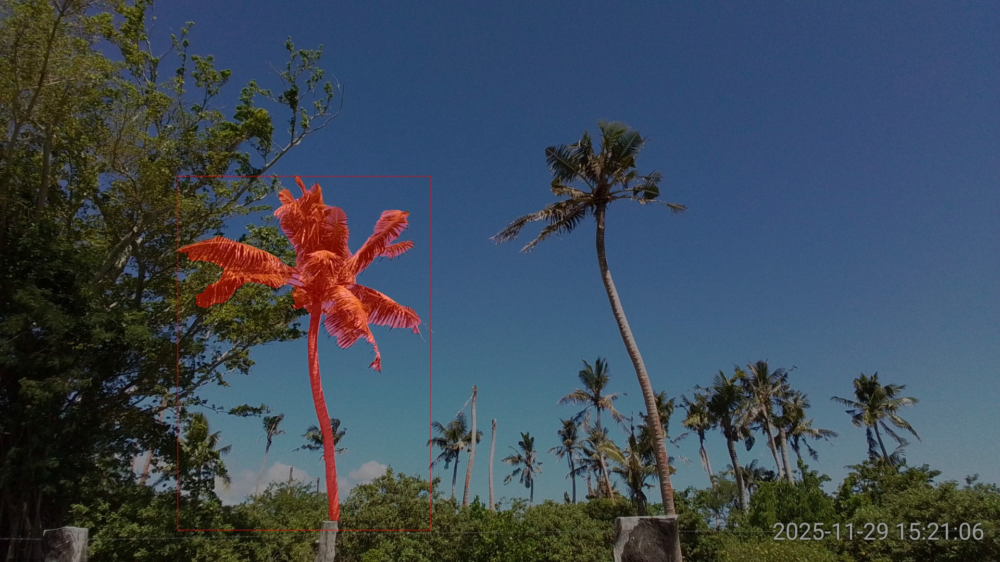

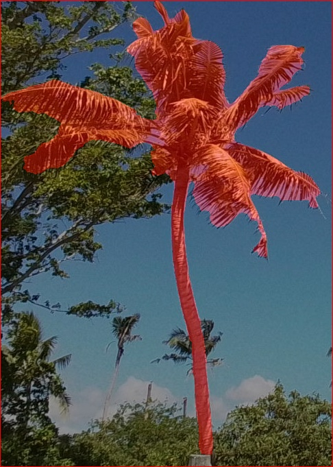

### Attributes

- [x] accept
- [] healthy
- [x] damaged
- [] vcuts
- [] dead
- [] crowd
- [] occluded
- [] other_problem
---
## Detected object 07 confidence: 0.699 object_index: 2


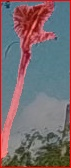

### Attributes

- [x] accept
- [] healthy
- [x] damaged
- [] vcuts
- [] dead
- [] crowd
- [] occluded
- [] other_problem
---
## Detected object 08 confidence: 0.691 object_index: 20

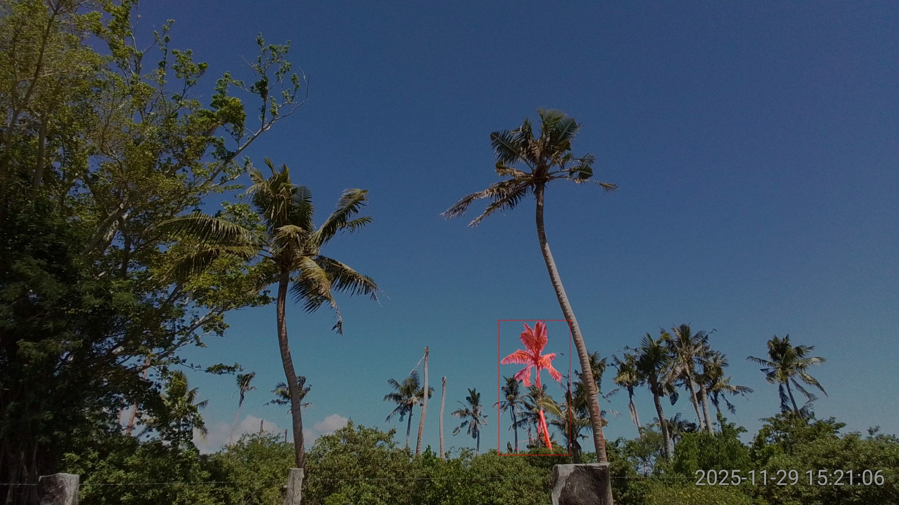

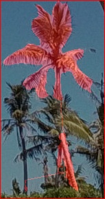

### Attributes

- [] accept
- [] healthy
- [] damaged
- [] vcuts
- [] dead
- [] crowd
- [x] occluded
- [] other_problem
---
## Detected object 09 confidence: 0.678 object_index: 7


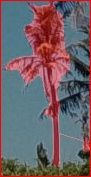

### Attributes

- [x] accept
- [] healthy
- [x] damaged
- [] vcuts
- [] dead
- [] crowd
- [] occluded
- [] other_problem
---
## Detected object 10 confidence: 0.650 object_index: 0

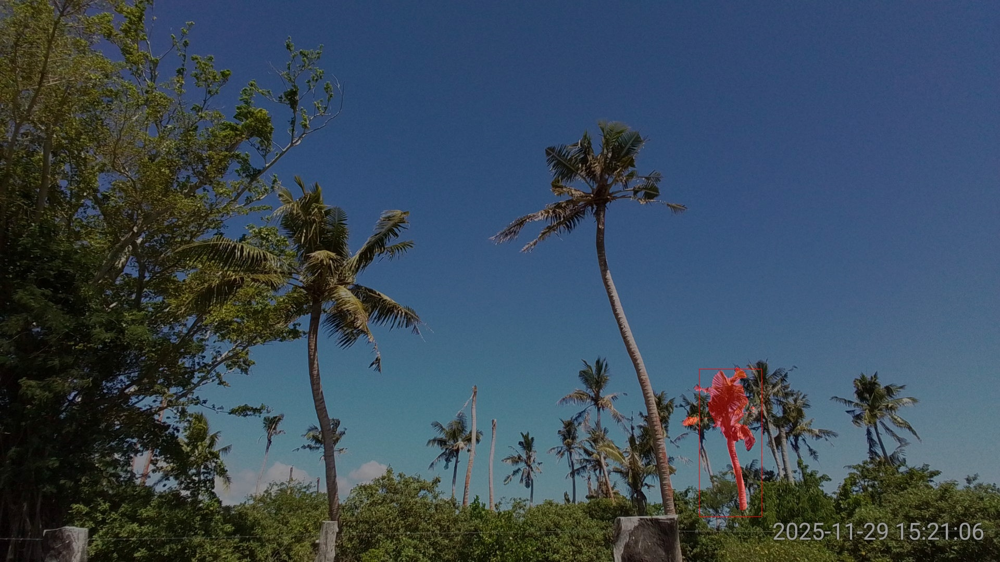

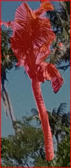

### Attributes

- [x] accept
- [] healthy
- [x] damaged
- [] vcuts
- [] dead
- [] crowd
- [] occluded
- [] other_problem
---
## Detected object 11 confidence: 0.630 object_index: 24

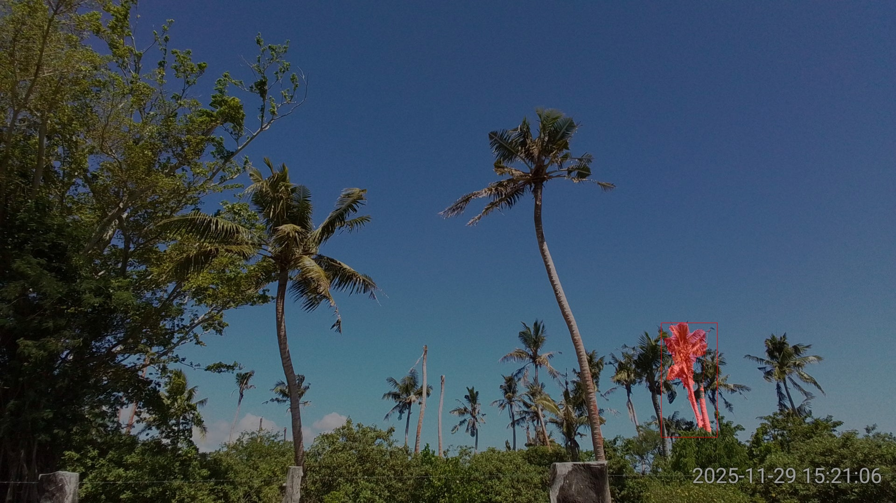

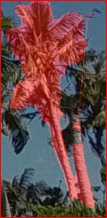

### Attributes

- [] accept
- [] healthy
- [] damaged
- [] vcuts
- [] dead
- [x] crowd
- [] occluded
- [] other_problem
---
## Detected object 12 confidence: 0.616 object_index: 8


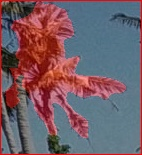

### Attributes

- [x] accept
- [] healthy
- [x] damaged
- [x] vcuts
- [] dead
- [] crowd
- [] occluded
- [] other_problem
---
## Detected object 13 confidence: 0.568 object_index: 22

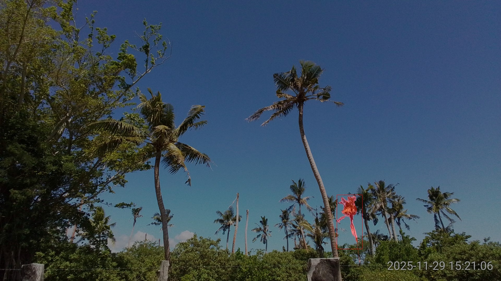

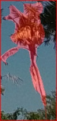

### Attributes

- [x] accept
- [] healthy
- [x] damaged
- [] vcuts
- [] dead
- [] crowd
- [] occluded
- [] other_problem
---
## Detected object 14 confidence: 0.535 object_index: 15

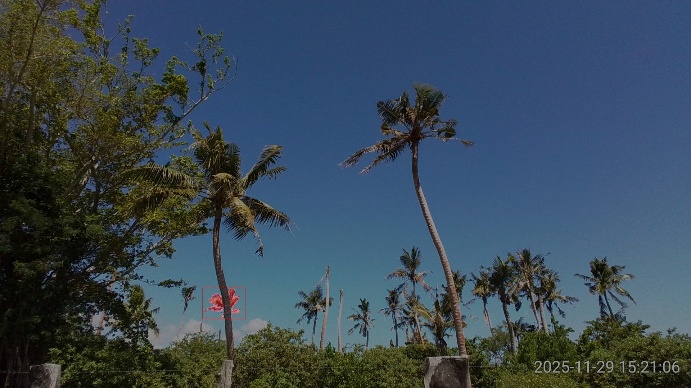

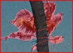

### Attributes

- [] accept
- [] healthy
- [] damaged
- [] vcuts
- [] dead
- [] crowd
- [x] occluded
- [] other_problem
---
## Detected object 15 confidence: 0.511 object_index: 14


### Attributes

- [x] accept
- [] healthy
- [] damaged
- [] vcuts
- [x] dead
- [] crowd
- [] occluded
- [] other_problem
---
## Detected object 16 confidence: 0.480 object_index: 4

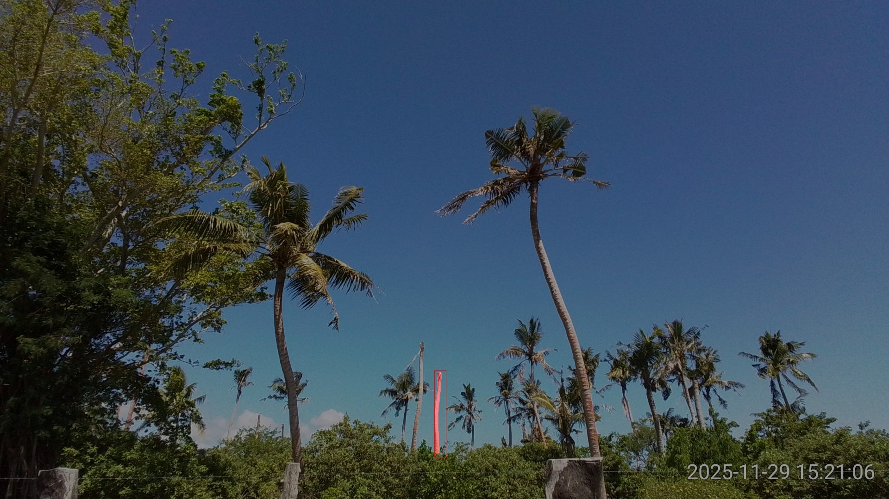


### Attributes

- [x] accept
- [] healthy
- [] damaged
- [] vcuts
- [x] dead
- [] crowd
- [] occluded
- [] other_problem
---
## Detected object 17 confidence: 0.470 object_index: 11

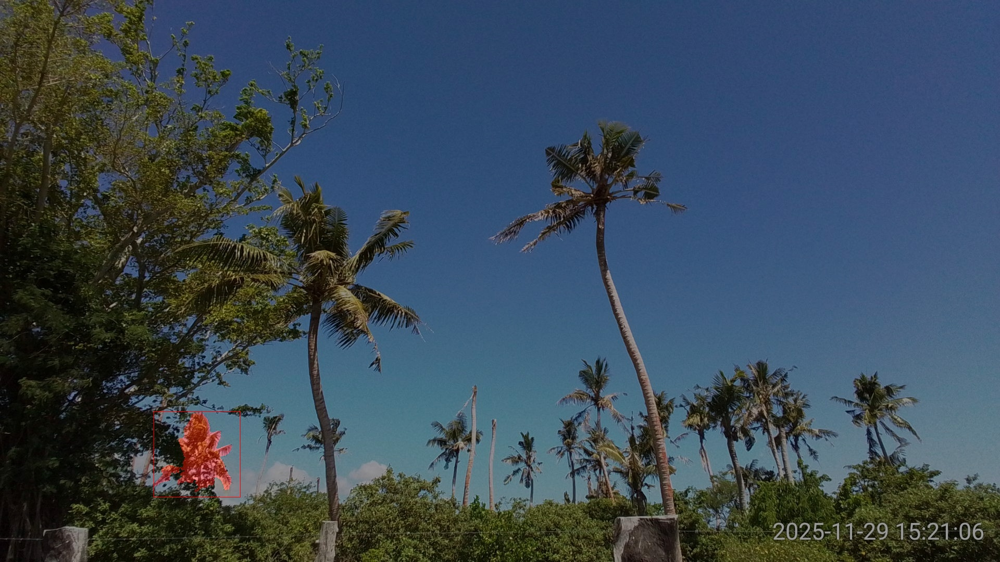

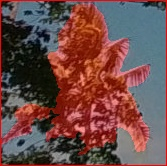

### Attributes

- [] accept
- [x] healthy
- [] damaged
- [] vcuts
- [] dead
- [] crowd
- [x] occluded
- [] other_problem
---
## Detected object 18 confidence: 0.458 object_index: 10

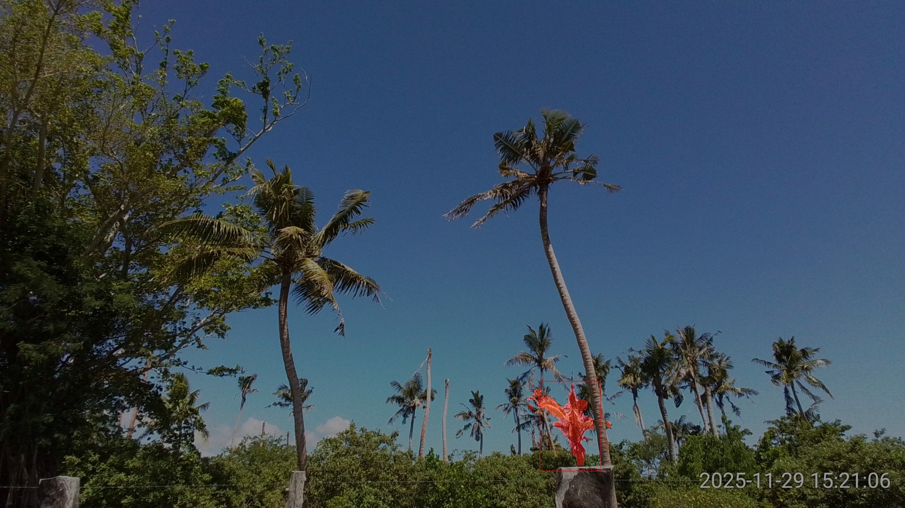

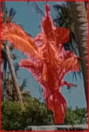

### Attributes

- [x] accept
- [] healthy
- [x] damaged
- [x] vcuts
- [] dead
- [] crowd
- [] occluded
- [] other_problem
---
## Detected object 19 confidence: 0.412 object_index: 21


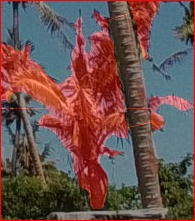

### Attributes

- [] accept
- [] healthy
- [] damaged
- [] vcuts
- [] dead
- [] crowd
- [x] occluded
- [] other_problem
---
## Detected object 20 confidence: 0.402 object_index: 19


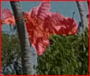

### Attributes

- [] accept
- [] healthy
- [] damaged
- [] vcuts
- [] dead
- [] crowd
- [x] occluded
- [] other_problem
---
## Detected object 21 confidence: 0.397 object_index: 23


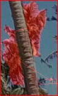

### Attributes

- [] accept
- [] healthy
- [] damaged
- [] vcuts
- [] dead
- [] crowd
- [x] occluded
- [] other_problem
---
## Detected object 22 confidence: 0.348 object_index: 6


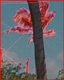

### Attributes

- [] accept
- [] healthy
- [] damaged
- [] vcuts
- [] dead
- [] crowd
- [x] occluded
- [] other_problem
---
## Detected object 23 confidence: 0.344 object_index: 18

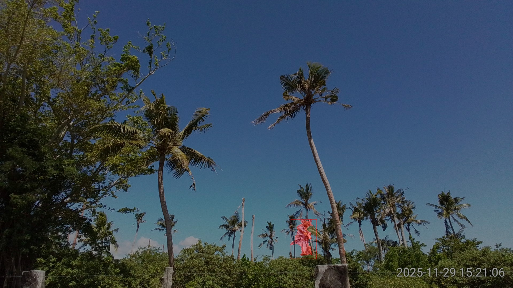

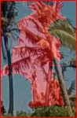

### Attributes

- [] accept
- [] healthy
- [] damaged
- [] vcuts
- [] dead
- [x] crowd
- [] occluded
- [] other_problem
---
## Detected object 24 confidence: 0.320 object_index: 13

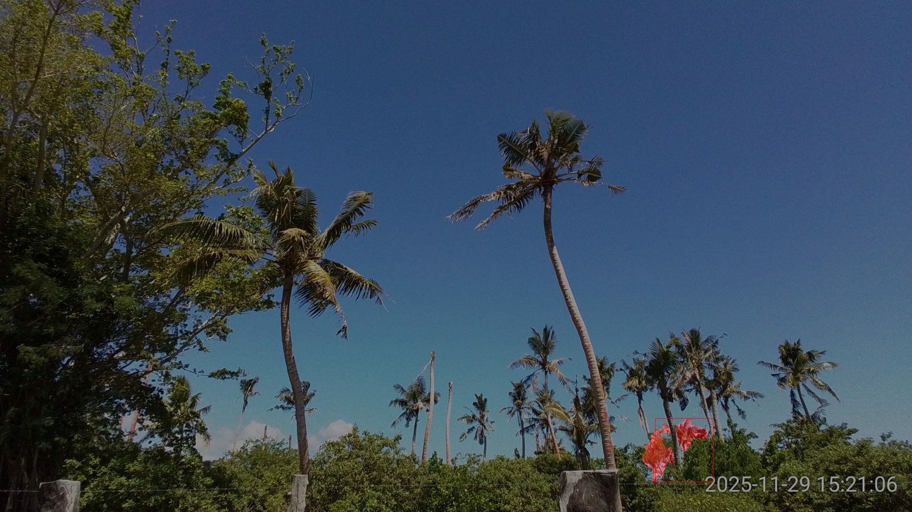

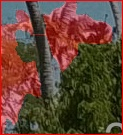

### Attributes

- [] accept
- [] healthy
- [] damaged
- [] vcuts
- [] dead
- [] crowd
- [x] occluded
- [] other_problem
---
## Detected object 25 confidence: 0.281 object_index: 17


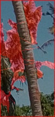

### Attributes

- [] accept
- [] healthy
- [] damaged
- [] vcuts
- [] dead
- [x] crowd
- [] occluded
- [] other_problem
---
## Detected object 26 confidence: 0.260 object_index: 1

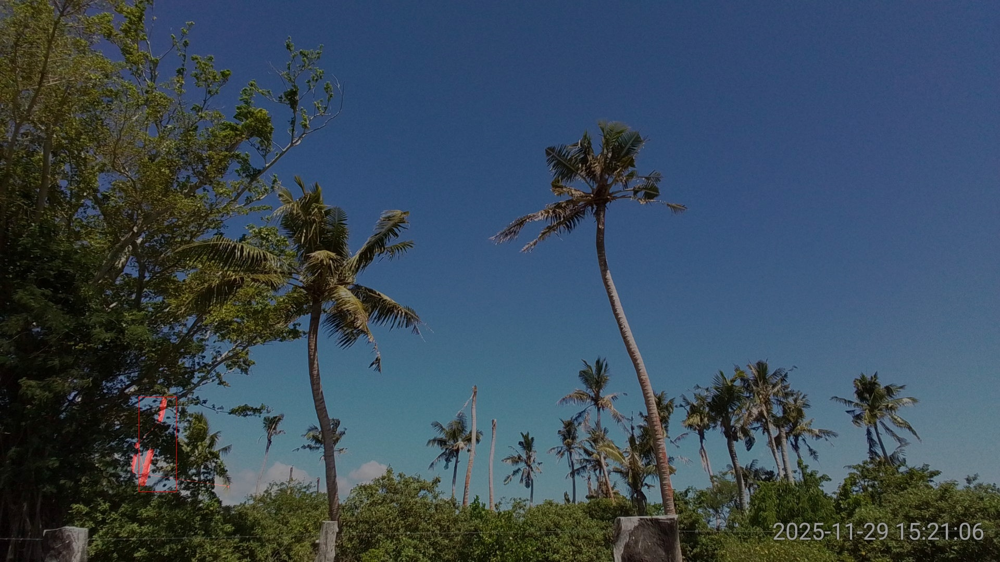

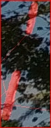

### Attributes

- [] accept
- [] healthy
- [] damaged
- [] vcuts
- [] dead
- [] crowd
- [x] occluded
- [] other_problem
---

# Results

<!--
```{csv-table} A caption for your table
:file: /home/aubrey/Desktop/jb/data/data_for_sam3_post/detection_attributes.csv
:header-rows: 1
:widths: auto
```
-->

```{csv-table} My table
:header: n,conf,i,accept,healthy,damaged,vcuts,dead,crowd,occluded,other

2,0.842,16,True,False,True,False,False,False,False,False
3,0.771,5,False,True,False,False,False,True,False,False
4,0.764,9,True,False,True,False,False,False,False,False
5,0.743,3,False,True,False,False,False,False,True,False
6,0.73,12,True,False,True,False,False,False,False,False
7,0.699,2,True,False,True,False,False,False,False,False
8,0.691,20,False,False,False,False,False,False,True,False
9,0.678,7,True,False,True,False,False,False,False,False
10,0.65,0,True,False,True,False,False,False,False,False
11,0.63,24,False,False,False,False,False,True,False,False
12,0.616,8,True,False,True,True,False,False,False,False
13,0.568,22,True,False,True,False,False,False,False,False
14,0.535,15,False,False,False,False,False,False,True,False
15,0.511,14,True,False,False,False,True,False,False,False
16,0.48,4,True,False,False,False,True,False,False,False
17,0.47,11,False,True,False,False,False,False,True,False
18,0.458,10,True,False,True,True,False,False,False,False
19,0.412,21,False,False,False,False,False,False,True,False
20,0.402,19,False,False,False,False,False,False,True,False
21,0.397,23,False,False,False,False,False,False,True,False
22,0.348,6,False,False,False,False,False,False,True,False
23,0.344,18,False,False,False,False,False,True,False,False
24,0.32,13,False,False,False,False,False,False,True,False
25,0.281,17,False,False,False,False,False,True,False,False
26,0.26,1,False,False,False,False,False,False,True,False
```


# References

:::{iframe} https://www.youtube.com/embed/BE2Nu3edyOo
:width: 100%
:align: center
:::